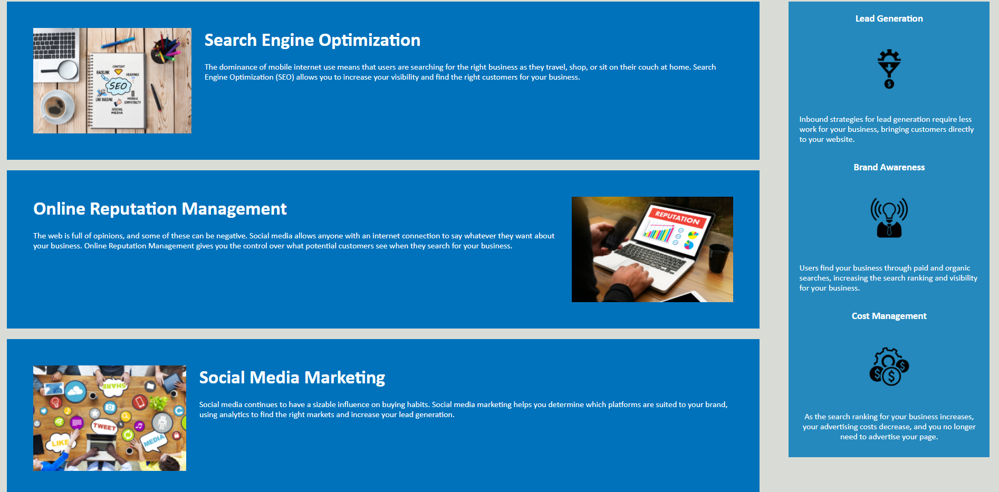

# horiseon-webpage-refactoring

## Link to deployed application: https://warr98.github.io/horiseon-webpage-refactoring/

## Refactoring Horiseon Webpage Code
    * Webpage remains the same display.
    * Application's links all function correctly without any changes.
    * All HTML elements are semantic after refactoring.
    * Standardized all HTML elements.
    * Added alt attributes to all icon and image elements.
    * Altered webpage title to Horiseon.
    * Organized CSS selectors with same properties into one group.

   
   
   
   Images above are screenshots of deployed application.Code had been improved without changing what it does.
   
